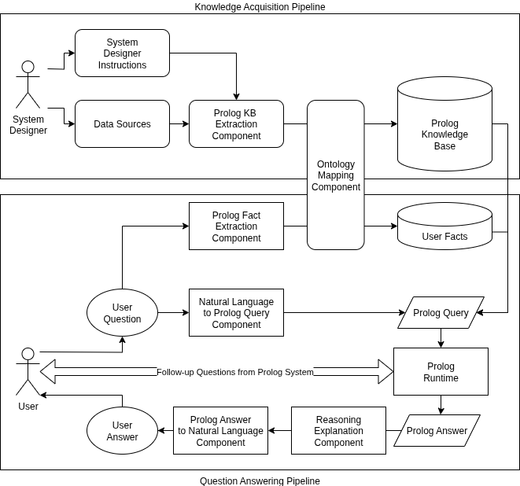

# Knowledge Acquisition and Question Answering with Expert Systems using LLMs

An important drawback of modern AI systems, especially LLMs, is that they largely
operate as a black box. It is not fully understood how information is stored within
neural networks of, for example, the transformer architecture or how such a model
accesses and processes information to reason about questions (Chen et al. 2025). During
training, models learn approaches to solving tasks in ways that are not understandable
or verifiable by a human. This leads to a variety of issues.
Without being able to understand the processes of how an LLM accesses and processes
learned information, it is challenging to determine whether an answer is factually correct.
There are a variety of approaches to mitigate this problem. One of the most prominent
examples are retrieval-based systems which focus on adding relevant domain knowledge
during inference time. This is usually done by adding the retrieved text to the user
prompt. An important advantage of this approach is that the information retrieved
during the generation of the answers can be used to manually verify the accuracy of
the answer. However, following the retrieval-based approach above, some key challenges
remain:
Correctness: Although retrieval-based approaches help users verify the correctness
of the information, it is usually not feasible to guarantee that the responses generated by
the system are correct. It is possible that the domain knowledge retrieved by the system
is not relevant to the user question, that the retrieved information does not contain all
relevant context, or that the LLM does not faithfully reflect the information within the
retrieved data.
Reasoning: Retrieval-based approaches often rely on inference-time reasoning using
chain-of-thought approaches to solve complex user questions. This approach empirically
improves the accuracy of the answers; however, research suggests that the reasoning steps
generated as part of the answer do not faithfully reflect the actual reasoning processes
performed by the LLM (Chen et al. 2025). Hence, it remains a challenge to faithfully
determine and explain the reasons why an LLM generated an answer. As inference-time
reasoning using chain-of-thought prompts works within the black-box of an LLM, no
improvements regarding correctness guarantees are made.
Determinism: An important challenge of the probabilistic nature of LLMs is that
their behavior in real-life scenarios is difficult to predict or evaluate. Especially in high-
risk applications such as medical scenarios, it is important to guarantee appropriate
behavior in all possible scenarios.
Transparency: Another challenge related but not identical to correctness is trans-
parency. The lack of transparency in many machine learning approaches exacerbates the
issues of correctness. If a model behaves incorrectly in a transparent manner, e.g. the
processing steps which lead to the answer are understandable by a human, identifying
a problem becomes much easier. This is an essential property to mitigate problems re-
garding correctness in a real-life application, as it enables users to better decide whether
to trust an answer or not. As previously mentioned, RAG systems already increase the
level of transparency by referencing source material used for answer generation. Never-
theless, even if a document was referenced by the model, it is not guaranteed, that the
answer of the model matches the content of the document. Hence, an approach which
makes the answer generation process itself transparent would be beneficial.
Maintainability: Maintainability means the ease and granularity of updating the
behavior of the model. Expanding upon transparency, maintainability is an important
property to correct errors, add new information, or update outdated information. This
enables for a process of incremental improvements, continuously adapting a system to
real-life problems. Modern machine learning approaches are not easy to maintain. Often,
large quantities of data are necessary for a model to learn new information through a
resource intensive training or finetuning process. Additionally, the influence new training
data has on the model as a whole in respect to side-effects, is difficult to predict. An
alternative approach enabling the modification of individual pieces of information with
predictable effects on the behavior of the system would be beneficial. RAG-systems
improve maintainability by enabling models to access a repository of documents that
are relevant for a given question. The information reflected by the model can then be
updated by modifying information within the underlying documents. An important
issue of this approach is the complexity of retaining a high quality data source within
a large and growing corpus of documents. Another important issue is, that developing
a functioning retrieval pipeline for a RAG-system that accurately retrieves relevant
information with necessary context is a challenging and error prone task. It would be
advantageous to be able to directly update unique pieces of information that determine
the behavior of the system.
In order to tackle the challenges described above, an alternative system with design-
time retrieval and reasoning is presented. In contrast to existing retrieval-based systems
where context is retrieved and reasoning is performed dynamically for a given question,
a system is proposed which focuses on precomputing an information representation that
contains all relevant retrievable information as well as all relevant reasoning processes.
This can be viewed as a general purpose retrieval task aimed at capturing relevant
information and reasoning approaches for future questions. The goal is to represent
the retrieved information as Prolog rules and facts. This logic-based representation of
information natively incorporates the capability to express complex reasoning processes
found within the source text. Prolog runtimes enable the utilization of transparent and
maintainable Prolog knowledge bases with advanced querying capabilities, providing
explainable, deterministic, and correct query results. Applying this methodology
on a knowledge base that consists of a general purpose retrieval has the capability of
solving the previously mentioned objectives.
This approach of formalizing knowledge into a technical language such as Prolog is not
new, and the advantages regarding correctness, reasoning, determinism, transparency,
and maintainability were a motivating factor for their development in the past. This
category of technical approaches can be called "rule-based expert systems". The main
challenge in construction of an expert system was the fact that knowledge bases had to
mostly be handcrafted by domain- and technical experts. This endeavor turned out to
be very time consuming as the communication between domain- and technical experts
tended to be inefficient and the technical modeling of information was complex. In
order to leverage existing know-how within the research domain of expert systems, the
thesis will look at approaches for automating the challenging knowledge acquisition task
of expert systems while taking inspiration from the design of existing expert system
architectures.

